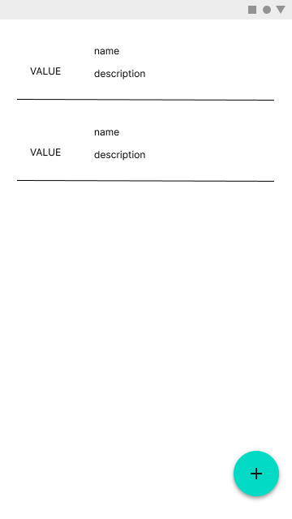

# Challenge 3

You will need to structure a feature that populates a list of comments after tapping a button.
The comment model can be found at `models/comment.dart` and the list item should be designed as follows.

On the left side of the item you need to place the `comment.value` attribute and on the right side you must place the `comment.name` and `comment.description`. Like bellow:

Note that this image is just to demonstrate the elements and how they should be placed.

In order to fetch the comment at the button tap, please use the `getRandom` method located on the `CommentRepository` class.

Feel free to use any state management and architecure to complete this.
